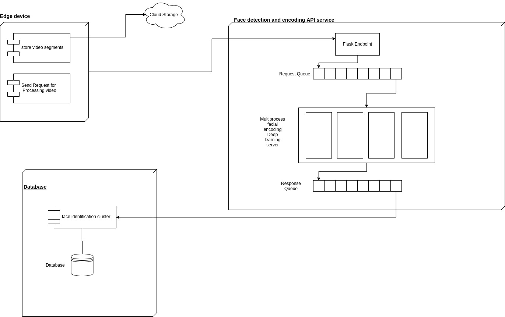

# Presence tracker system

#### Basic Design of the system
 

There are three major components of the system 
1. The Edge device
2. API service
3. The database

#### The Edge device
The edge device captures and uploads video to cloud. Then it sends a request to the API service to process the 
video.

#### The API service
The API service has an exposed flask endpoint. This request is stored in a queue.

The API service hosts multiple instances of deep neural network to perform faster encoding of the 
detected faces in the videos. This is achieved by not reloading the computation graph on the GPU for every 
 request. Each encoded face is then pushed to a response queue.

Each response from the queue is then sent to the database server for recognition and storage.

#### The Database server
This consists of two components
1. Recognition cluster 
2. Database

The recognition cluster will identify the person from the responses of the API service and then store 
it in the database

